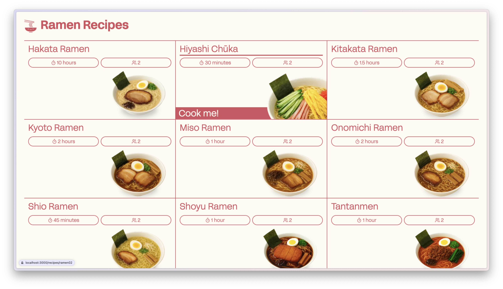

# Recipe App

A modern ramen recipe application built with Next.js that allows users to browse a collection of ramen recipes, view detailed ramen recipe information, and access cooking instructions. The app demonstrates the use of React hooks, state management, and responsive design, with data served from a local API endpoint. For more details about the data structure and project requirements, see [INSTRUCTIONS.md](./INSTRUCTIONS.md).

## Features
- Browse a collection of ramen recipes on the home page
- View detailed ramen recipe information including ingredients and cooking instructions
- Responsive design for optimal viewing on all devices
- Clean and intuitive user interface

## Getting Started

To set up and run the project locally:

```bash
npm install
npm run dev
```

Open [http://localhost:3000](http://localhost:3000) with your browser to see the result.

You can start editing the page by modifying `app/page.tsx`. The page auto-updates as you edit the file.

## Data Source

Recipe data is served from a local API endpoint. For more details about the data structure and project requirements, see [INSTRUCTIONS.md](./INSTRUCTIONS.md).

## Screenshots

### Homepage (Recipe List)


### Recipe Details Page


### Loading State


### Error State


### Not Found State


### Responsive Design


### Demo
https://github.com/user-attachments/assets/e67f6c41-9c41-43da-8c4b-c5c78d4e5a5d


## Learn More

To learn more about Next.js, take a look at the following resources:

- [Next.js Documentation](https://nextjs.org/docs) - learn about Next.js features and API.
- [Learn Next.js](https://nextjs.org/learn) - an interactive Next.js tutorial.

You can check out [the Next.js GitHub repository](https://github.com/vercel/next.js) - your feedback and contributions are welcome!

## Deploy on Vercel

The easiest way to deploy your Next.js app is to use the [Vercel Platform](https://vercel.com/new?utm_medium=default-template&filter=next.js&utm_source=create-next-app&utm_campaign=create-next-app-readme) from the creators of Next.js.

Check out our [Next.js deployment documentation](https://nextjs.org/docs/app/building-your-application/deploying) for more details.
